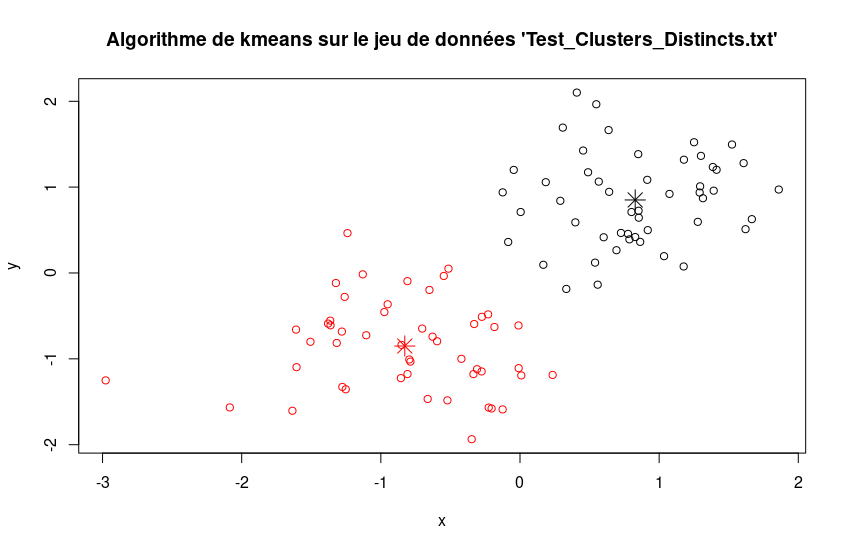
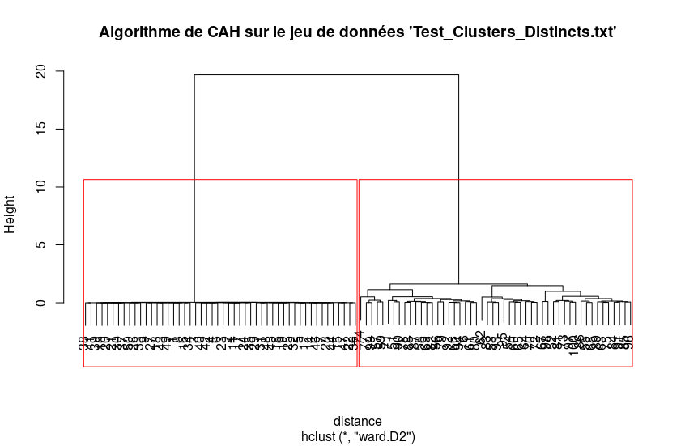

# Clustering

## Description
Utilisation de deux algorithmes de clustering : kmeans et CAH à travers des jeux de données.

## Algorithme kmeans
Test avec 2 classes sur le jeu de donées Test_Clusters_Distincts.txt :

## Algorithme CAH
Test avec 2 classes sur le jeu de donées Test_Clusters_Distincts.txt :

